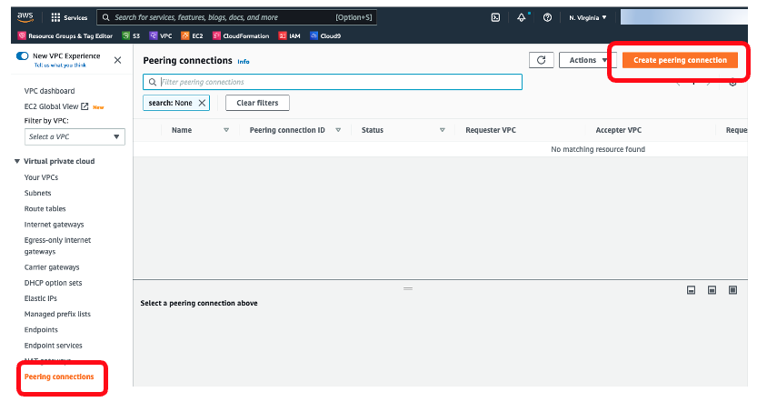
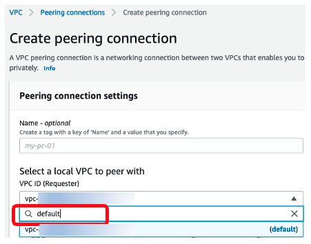
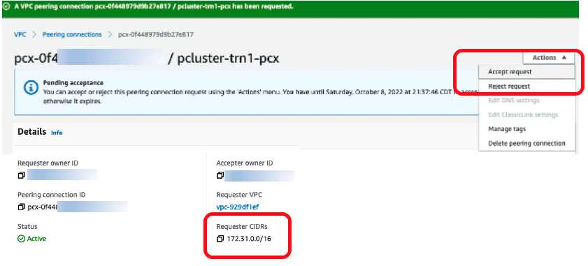

# Peering Connection setup for ParallelCluster with Trn1

A peering connection between your default VPC and the ParallelCluster's VPC is needed. The peering connection enables you to route traffic between the two VPCs privately. This peering connection needs to be added to the route table of the ParallelCluster's public subnet. Below are the instructions.

1. **Create Peering Connection** - In your VPC dashboard, go to `Peering connections` tab in the left panel, and on top right, click `Create Peering Connection`:

This will lead you to more configuration and choices.

2. **Requester VPC** - For Requester VPC, use your default VPC ID. You may find it via search for `default` in the space:

Once you find it, make sure it is designated in the box.

3. **Accepter VPC** - For Accepter VPC, use the VPC you just created for ParallelCluster:

You may leave everything else as default.

4. **Accept request** - You need to make sure to perform `Accept request` so your peer connection is ready for use:

Also, make a note of the Requester CIDRs. This will be added to the public subnet’s route table later.

