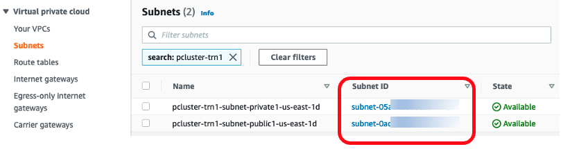
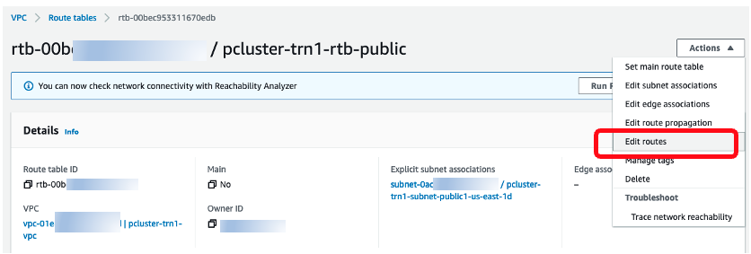
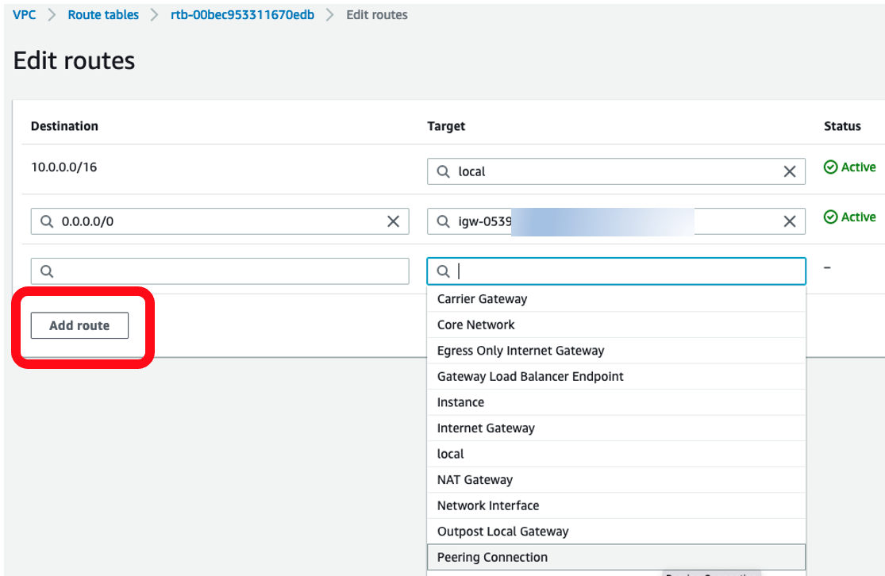
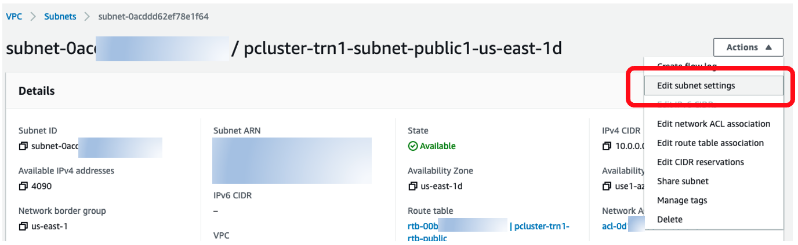
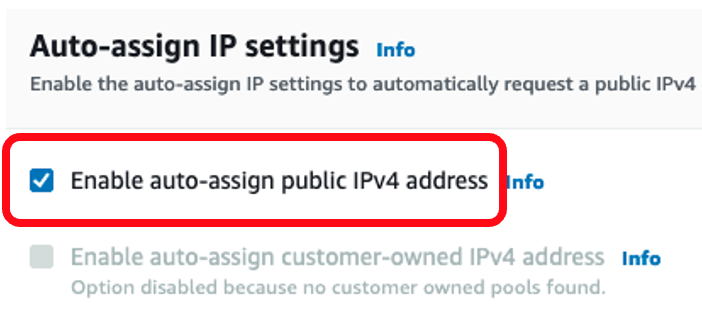

# Subnet setup for ParallelCluster with Trn1

Public subnet is where the head node resides. In this subnet, the route table must have peer connection to your default VPC. Here are the steps to add the peer connection to the route table:

1. **Identify subnet by VPC ID** - Now in Subnets tab, find the subnets associated with your ParallelCluster’s VPC. There should be one private and one public subnet. We are going to edit settings in these subnets by clicking on these Subnet ID.

Click on the public subnet's ID.

2. **Find route table** - Once you enter the public subnet panel, click on Route table:

This will take you into the route table.

3. **Edit rout table** - Now in the `Action` dropdown box, click on `Edit routes`:

This will take you to a panel to make edits.

4. **Add route** - This is where you add the peering connection to the route table. Click on `Add route`, and then in Target column, look for `Peering Connection`:

The peering connection you just created should appear. Put it in the Target column.

5. **Add peering connection's CIDRs** - Now you just need to add the peering connection's CIDR in the Destination column:

And then click `Save changes`. 

6. **IPv4 address** - Back in the public subnet panel, in its `Actions` dropdown box, select `Edit subnet settings`:

This will take you to the next setting page. Here, you need to check `Enable auto-assign public IPv4 address:

These are all the changes you need to make for the public subnet.