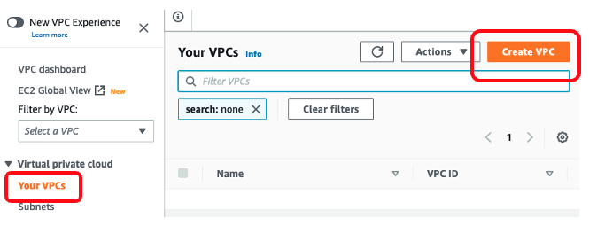
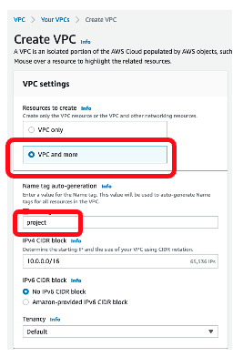
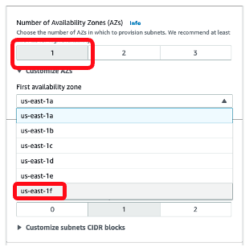

# VPC setup for ParallelCluster with Trn1
# VPC setup for ParallelCluster with Trn1

Here are the detailed, step-by-step instructions for creating a VPC and infrastructure within it. These instructions are based on AWS console. 

1. **Create VPC (and more)** - For this step, you will use your AWS console's VPC dashboard. In this dashboard:



Once you proceed, you will see the following. Select **VPC and more** because you will create subnets and NAT gateway in this process. Also, give 
a project name for convenience.



From here and on, we will set remaining parameters for infrastructures in this VPC. 

2. **Select Availability Zone (AZ)** - Select one AZ for your ParallelCluster VPC. Next, select the AZ that maps to your account. This AZ must also contains Trn1 instance.



 To verify which Trn1 AZ is mapped to your account, use the following code snippet in your desktop:

```
AZ1=$(aws ec2 describe-availability-zones \
--region us-east-1 \
--query "AvailabilityZones[]" \
--filters "Name=zone-id,Values=use1-az4" \
--query "AvailabilityZones[].ZoneName" \
--output text)

AZ2=$(aws ec2 describe-availability-zones \
--region us-east-1 \
--query "AvailabilityZones[]" \
--filters "Name=zone-id,Values=use1-az5" \
--query "AvailabilityZones[].ZoneName" \
--output text)

AZ3=$(aws ec2 describe-availability-zones \
--region us-west-2 \
--query "AvailabilityZones[]" \
--filters "Name=zone-id,Values=usw2-az4" \
--query "AvailabilityZones[].ZoneName" \
--output text)

echo -e "\nYour Trn1 availability zones are $AZ1, $AZ2, $AZ3\n"

```

An example output of the above snippet may be:

`Your Trn1 availability zones are us-east-1a, us-east-1f, us-west-2d`

3. **Set up subnets** - You need a public subnet and private subnet. The public subnet will host the head node, while the private subnet will host the compute nodes. In order for the compute nodes to access the web for software upgrade and installation, you need a NAT gateway in this AZ. 


These are all the configurations needed to set up a VPC and the infrastructure inside. Now click `Create VPC`. This will create the VPC, two subnets, and one NAT gateway. 

